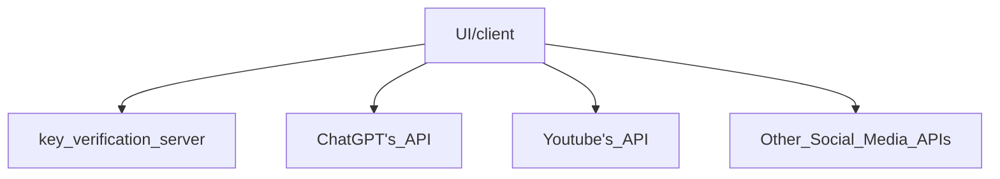

1. My dad has a small business in the gun industry. The majority advertisement platforms don't like the gun industry, but some social media platforms like youtube do allow videos that talk about the gun industry to some degree. YouTube policies don't allow links to sites that sell guns, but it looks like they do allow talking about your gun selling company name and what your company does. So the plan is to make an AI tool that can create and post social media content (mainly youtube videos for now) that talks about my dad's company so that he can get the company name out there without using paid advertisements.

2. Since this tool is not even a start up company but just a product, there needs to be zero or near-zero operational costs AKA no overhead. So currently planning to make the tool as a desktop app with no backend server except to validate the key for using the product. So that means we will need to find a solution like wasm to run logic natively for any logic that needs to be speedy. The plan for languages currently is vue 3 and golang or python.

3. This project is an open source project so really anyone can use it for free, but they will have to know how to remove the launch page that I will be adding that will ask for a XX dollars monthly token key to use the software. Since the tool runs mostly on the machine of the user and all the data is likely to be public since it is marketing data, there probably won't be too many security concerns. There could be a need for data privacy in B2B marketing, and so eventually the software will need a privacy policy and user agreement. I don't know much about those, so I will cross that bridge when I get to it.