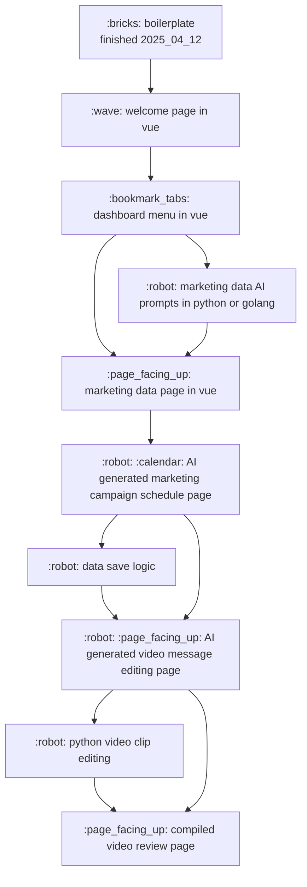

```mermaid
flowchart TD
    boil["`:bricks: boilerplate
    finished 2025_04_12`"]
    welcome["`:wave: welcome page in vue`"]
    dash["`:bookmark_tabs: dashboard menu in vue`"]
    prompts["`:robot: marketing data AI prompts in python or golang`"]
    save["`:robot: data save logic`"]
    clips["`:robot: python video clip editing`"]
    data["`:page_facing_up: marketing data page in vue`"]
    schedule["`:robot: :calendar: AI generated marketing campaign schedule page`"]
    message["`:robot: :page_facing_up: AI generated video message editing page`"]
    result["`:page_facing_up: compiled video review page`"]
    boil --> welcome
    welcome --> dash
    dash --> prompts
    dash --> data
    prompts --> data
    schedule --> save
    save --> message
    data --> schedule
    schedule --> message
    message --> clips
    clips --> result
    message --> result

```